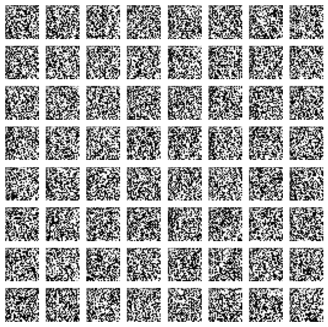
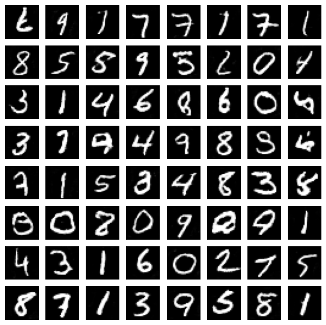
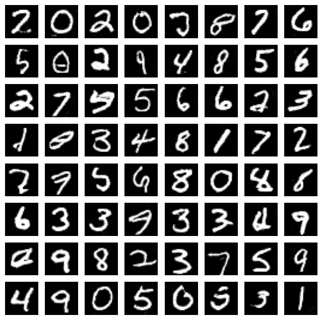
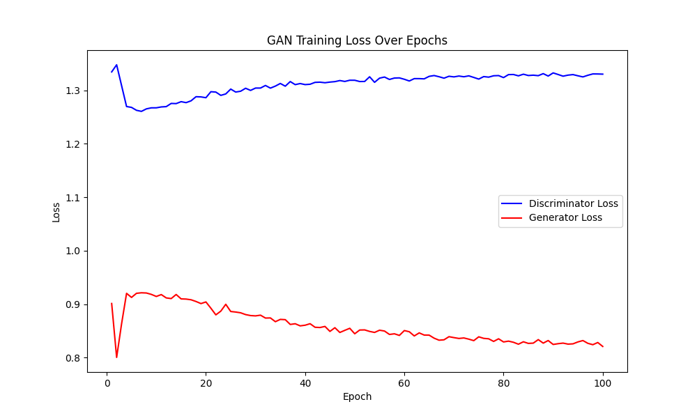
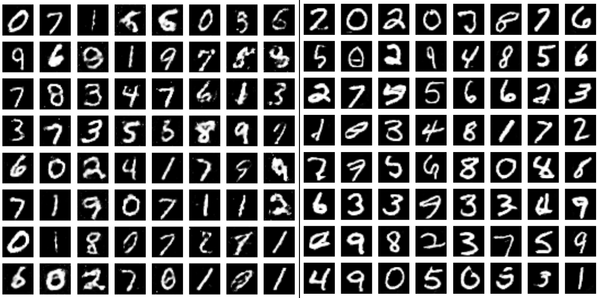

# DCGAN MNIST Handwritten Digit Generation

English  /  [中文](readme_zh.md)

↑ 点击切换语言

This project uses the **DCGAN** framework to improve image generation quality with convolutional neural networks. It trains the generator and discriminator in an adversarial manner to gradually generate realistic handwritten digit images.

The following three images display the generated images before training, at epoch 50, and at the end of training.

**Before Training**



**Epoch 50**



**Epoch 100**



The figure below shows the change in **discriminator loss** and **generator loss** during the training process.



Compared to a standard GAN (left image), DCGAN uses convolutional structures, which results in clearer images.



## Table of Contents

- [Multilingual Annotations](#multilingual-annotations)
- [Dataset](#dataset)
- [File Structure](#file-structure)
- [License](#license)
- [Contribution](#contribution)

## Multilingual Annotations

To help developers from different language backgrounds better understand the code, this project provides annotations in both English and Chinese versions.

## Dataset

The dataset used in this project is the **MNIST** dataset, a classic handwritten digit dataset widely used for training and testing machine learning and deep learning models.

The MNIST dataset can be downloaded using the following methods:

- [MNIST](http://yann.lecun.com/exdb/mnist/)
- Directly load the MNIST dataset using common deep learning frameworks.

In this project, the `datasets` module provided by `torchvision` is used to directly load the MNIST dataset.

## File Structure

The file structure of the project is as follows:

```c++
MNIST_DCGAN/
│
├── data/ 
│   └── MNIST (empty, auto-download on run)
│
├── images/ 
│   └── epoch_*.png
│
├── model/ 
│   ├── netD.pth
│   └── netG.pth
│
├── utils(en/zh)/
│   ├── dataloader.py
│   ├── discriminator.py
│   ├── generator.py
│   └── train.py
│
├── contrast.png
├── loss_plot.ipynb
├── loss_plot.png
├── mnist_train.csv
├── readme.md
└── main.py 
```

## License

This project is licensed under the MIT License. For more details, please refer to the [LICENSE](LICENSE) file.

## Contribution

All forms of contributions are welcome! Whether it’s reporting a bug or making suggestions, your support is greatly appreciated!
