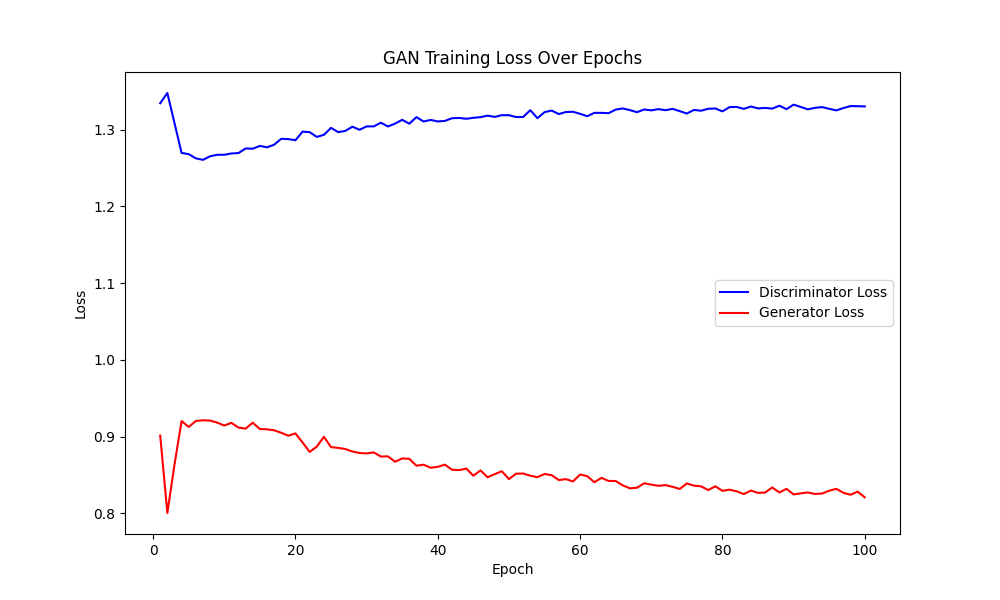

# DCGAN MNIST手写数字生成

[English](readme.md)  /  中文

↑ Click to switch language

本项目通过 **DCGAN** 框架 使用卷积神经网络提升图像生成质量 通过生成器和判别器对抗训练 逐步生成逼真的手写数字图像

以下三张图片分别展示了训练开始前 第50轮 和训练结束时生成的图像

**开始前**


**第50轮**


**第100轮**


下图展示了该模型在训练过程中的 **判别器损失** 和 **生成器损失** 的变化趋势



相比普通 GAN ( 左图 ) DCGAN 利用卷积结构 更能生成清晰的图像


## 目录

- [多语言注释](#多语言注释)
- [数据集](#数据集)
- [文件结构](#文件结构)
- [许可证](#许可证)
- [贡献](#贡献)

## 多语言注释

为了让不同语言背景的开发者更容易理解代码 本项目的注释提供了英文和中文两种版本

## 数据集

本项目使用的数据集为 **MNIST** 数据集 这是一个非常经典的手写数字数据集 广泛用于机器学习和深度学习模型的训练和测试

MNIST 数据集可以通过以下方式下载

- [MNIST](http://yann.lecun.com/exdb/mnist/)
- 通过常用的深度学习框架直接加载 MNIST 数据集

在本项目中使用了 `torchvision` 提供的 `datasets` 模块直接加载 MNIST 数据集

## 文件结构

项目的文件结构如下

```c++
MNIST_DCGAN/
│
├── data/ 
│   └── MNIST(运行时自动下载)
│
├── images/ 
│   └── epoch_*.png
│
├── model/ 
│   ├── netD.pth
│   └── netG.pth
│
├── utils(en/zh)/
│   ├── dataloader.py
│   ├── discriminator.py
│   ├── generator.py
│   └── train.py
│
├── contrast.png
├── loss_plot.ipynb
├── loss_plot.png
├── mnist_train.csv
├── readme.md
└── main.py 
```

## 许可证

本项目使用 MIT 许可证。有关详细信息，请参阅 [LICENSE](LICENSE) 文件。

## 贡献

欢迎所有形式的贡献！无论是报告错误还是提出建议 非常感谢！！

